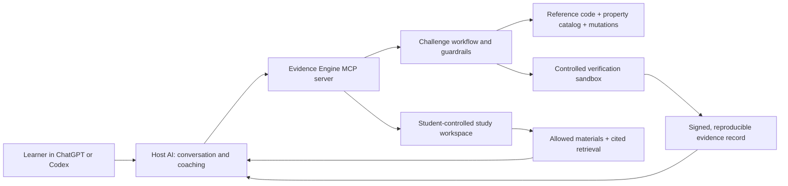

# Evidence Engine

> An AI study companion that does more than explain code: it creates safe practice,
> asks the learner to commit to their reasoning, runs the repair against real tests,
> and returns evidence the AI cannot invent.

Evidence Engine is a hackathon-stage learning product for computer science students.
It is designed to live inside tools students already use—ChatGPT and Codex—without
requiring a separate Evidence Engine account or API key.

The long-term product combines two complementary experiences:

1. **Verified code practice:** generate or select a safe coding challenge, ask the
   student to predict and diagnose before repairing it, then verify the repair in
   Evidence Engine's own sandbox.
2. **Course-grounded study support:** let a student voluntarily add allowed course
   materials and receive answers with citations to those materials, then use the
   same context to choose relevant practice topics.

The repository is an active prototype, not a finished product. Some parts are
working end to end locally; others are feasibility spikes or planned hackathon
work. The [current status](#what-exists-today) below is intentionally explicit.

## Team direction — September 2026

After a 30-minute team product deep dive, we agreed on a broader north star for
Evidence Engine: an institution-supported learning layer that reduces how much
AI setup and expertise a student needs before they can learn effectively.

In that future experience, a student could receive a professor- and IT-approved
class package when they enroll: shared skills, guardrails, hooks, tools, plugins,
and MCP servers already configured for the course. Canvas access or a companion
browser extension could supply permitted course context, while ChatGPT, Codex,
an agent, or a custom GPT provides the interaction surface. NotebookLM-style
capabilities—source-grounded questions and answers, citations, summaries, and
study aids—would sit alongside Evidence Engine's verified practice loop.

This is an **agreed product direction, not implemented functionality or approved
institutional architecture**. Permissions, privacy, procurement, provisioning,
browser-extension feasibility, and the exact open-source components all require
discovery with professors and university IT. The current safeguards remain in
force until a separate, reviewed decision changes them.

Read the canonical [team product direction and meeting recap](docs/TEAM_PRODUCT_DIRECTION.md),
the [one-page project brief](docs/EVIDENCE_ENGINE_PROJECT_BRIEF.docx), or the
[copy-ready Discord summary](docs/DISCORD_TLDR.md).

## How to interpret this repository

Evidence Engine changed direction several times while the team learned by building.
That history is useful, but **existing code and older documents do not automatically
describe the desired future product**.

- The [project charter](docs/PROJECT_CHARTER.md) is the current operational safety
  and data contract.
- The [team product direction](docs/TEAM_PRODUCT_DIRECTION.md) is the latest agreed
  north star, not a claim that the experience is implemented or institutionally
  approved.
- Source code and tests show current behavior only; some paths may be experiments
  that should later be replaced or removed.
- The [initial research archive](docs/research/INITIAL_RESEARCH_AND_INSPIRATION.md)
  contains inspiration, discarded directions, unverified leads, and explicit
  discrepancies for teammates to investigate—not requirements.

When these sources disagree, the discrepancy must be surfaced and resolved through
a dated team decision before implementation. Future changes should name obsolete
paths and remove dead code deliberately instead of preserving every experiment.

## Why this should exist

Watching an explanation and being able to reconstruct the reasoning are different
skills. A conversational AI can make a student feel confident by producing a fluent
answer or saying “correct,” but neither is evidence that the student can apply the
idea independently.

Evidence Engine changes the interaction:

```text
course objective → plan → prediction → controlled bug → diagnosis → repair
                                                        ↓
                                      sandboxed tests → evidence → targeted retry
```

The host AI coaches and explains. Evidence Engine owns the challenge, hidden tests,
execution, and result. That separation is the core product idea.

## The hackathon story

**The question:** What if an AI tutor had to show its work before telling a student
they succeeded?

**The answer:** Evidence Engine gives the learner a fresh, controlled code problem
and returns a reproducible evidence record from tests run outside the coaching
model's control.

**Why it is more than a chatbot wrapper:**

- a declarative property catalog describes what correct behavior means;
- AST mutation operators create realistic bugs;
- kill-ratio and equivalence checks reject weak or meaningless mutations;
- a constrained execution sandbox runs the submitted repair;
- signed challenge tokens and evidence records protect the workflow boundary;
- pre-repair tools are tested for answer leakage and over-helping;
- an MCP server makes the same engine available to Codex and, eventually, ChatGPT.

**The intended demo moment:** a learner predicts the next BFS frontier, diagnoses a
duplicate-frontier bug, proposes the lifecycle fix, and receives deterministic
evidence from executed tests—not praise generated by the AI.

## What exists today

| Area | Current state | Honest limitation |
| --- | --- | --- |
| Local learning UI | A working Next.js traversal lab supports plan commitment, BFS state prediction, Socratic diagnosis, repair confirmation, and an evidence map. | It is an internal development/QA surface built around one curated BFS experience, not the final ChatGPT App. |
| Verification kernel | Python modules implement a declarative property DSL, mutation generation, kill-ratio classification, differential equivalence checking, and sandboxed execution. The kernel has been exercised with BFS and binary search. | The catalog is still small, with two mutation-operator families; the sandbox is a development implementation, not production-hardened infrastructure. |
| MCP code-repair flow | `start_challenge`, `submit_prediction`, `submit_diagnosis`, and `submit_repair` form a token-backed workflow. A real Codex CLI client has successfully called the server over stdio. | Only the BFS challenge is wired through the full MCP learner flow. Tool-call ordering is not yet enforced by the token. |
| Study workspace | Five MCP tools can add plain-text materials, list/remove them, retrieve cited excerpts, and delete a workspace. | Storage is in-process, retrieval is keyword-based, file extraction is not implemented, and caller-supplied workspace IDs do not yet have ownership controls. |
| Canvas grounding | A checked-in mock demonstrates using course/module titles to select a relevant topic. A student-upload path can work without Canvas access. | There is no live Canvas integration. Any institutional Canvas path remains gated on approval and must exclude assignments, quizzes, discussions, and submissions. |
| ChatGPT connectivity | The streamable-HTTP server completed an external MCP `initialize` handshake through a temporary public tunnel. | A real ChatGPT client has not yet completed a tool call. The temporary transport has no production authentication. |
| Codex plugin | A private plugin preview supports consent-first, read-only source mapping and non-evaluative exploration modes. | It is an onboarding preview, not yet the complete Evidence Engine practice client. |
| Deployment | A Render blueprint exists for the API. | There is no verified, authenticated production deployment or public student release. |

For the detailed engineering record, see [the implementation plan](docs/IMPLEMENTATION_PLAN.md),
[MCP status](docs/MCP_SERVER.md), and the [study workspace notes](docs/STUDY_WORKSPACE.md).

## Product boundaries

These are design constraints, not optional polish:

- **No AI-authored verdicts.** A model may interpret an evidence record, but it may
  not decide whether code passed.
- **No mastery percentage.** The current targeting logic is a transparent practice
  heuristic, not a psychometrically validated mastery model.
- **No mutation of real graded work.** Code-repair challenges come from vetted
  reference implementations or generated practice—not a student's assignment,
  exam, quiz, discussion, or submission.
- **Student-controlled course context.** Course materials are added intentionally,
  must remain visible and deletable, and must not include graded submissions or
  answer keys.
- **No Evidence Engine LLM bill.** ChatGPT or Codex supplies the conversational
  model under the user's existing access. Evidence Engine pays only for the
  verification infrastructure it operates.
- **No hidden-test leakage.** The coach must not see hidden tests or the canonical
  repair before the learner submits an attempt.
- **Canvas stays gated.** Live institutional data must not flow until the access,
  privacy, and security path is explicitly approved.

The complete non-negotiable contract is in [the project charter](docs/PROJECT_CHARTER.md).
That charter predates the new study-workspace capability and needs a team-reviewed
revision before the capability can be treated as product-ready.

## Architecture at a glance



The browser UI talks to the same Python domain layer through a FastAPI service and
acts as a development harness for the learner flow.

## Run the local demo

### Prerequisites

- Python 3.12+
- [`uv`](https://docs.astral.sh/uv/)
- Node.js and [`pnpm`](https://pnpm.io/)

### 1. Install dependencies

```bash
make setup
```

### 2. Start the API

```bash
cd apps/api
uv run uvicorn app.main:app --reload
```

The API runs at `http://localhost:8000`; `GET /health` is the health check.

### 3. Start the web app

In a second terminal:

```bash
cd apps/web
pnpm dev
```

Open `http://localhost:3000` and follow [the demo runbook](docs/DEMO_RUNBOOK.md).
The web app uses `http://localhost:8000` by default. To override it, copy
`apps/web/.env.example` to `apps/web/.env.local` and change
`NEXT_PUBLIC_API_URL`.

### 4. Run the quality gate

```bash
make check
```

This runs repository-memory validation, Python and TypeScript linting/type checks,
the API and web test suites, and an API smoke test.

## Try the MCP server

Run the server over stdio:

```bash
cd apps/api
uv run python3 -m app.mcp_server
```

Or use the local browser-based MCP tool tester:

```bash
cd apps/api
uv run python3 ../../scripts/web_tester.py
```

Then open `http://localhost:8791`. The [MCP server guide](docs/MCP_SERVER.md)
contains the verified Codex CLI setup and the unfinished ChatGPT custom-connector
steps. Do not expose the development HTTP transport as a real deployment; it does
not yet have the required authentication and host protections.

## Repository map

```text
apps/
  api/       FastAPI service, MCP server, verification and learning domain logic
  web/       Next.js development/QA experience for the current BFS learner flow
docs/        Vision, charter, architecture decisions, plans, and demo instructions
fixtures/    Approved public challenges and mock Canvas data
memory/      Contributor handoffs and durable project decisions (no private data)
plugins/     Evidence Engine Tutor Codex plugin preview
scripts/     Local verification, connectivity, and demo helpers
```

Good starting points:

- [September 2026 team product direction](docs/TEAM_PRODUCT_DIRECTION.md)
- [Initial research and inspiration archive](docs/research/INITIAL_RESEARCH_AND_INSPIRATION.md)
- [Product vision](docs/VISION.md)
- [Implementation plan and risk register](docs/IMPLEMENTATION_PLAN.md)
- [Project invariants](docs/PROJECT_CHARTER.md)
- [MCP setup and connectivity status](docs/MCP_SERVER.md)
- [Canvas boundary and mock integration](docs/CANVAS_INTEGRATION.md)
- [Study workspace design](docs/STUDY_WORKSPACE.md)
- [Contributor and agent guide](AGENTS.md)

## Proposed path to a strong submission

The repository contains more engineering than the demo can communicate at once.
The submission should center one complete story and treat everything else as proof
of extensibility.

### Must-have demo path

1. **Align the product contract.** Reconcile the original code-practice invariants
   with the newer course-material workspace so teammates are building the same
   product.
2. **Complete one real host integration.** Finish a real ChatGPT custom-connector
   tool call or deliberately make Codex the primary live demo surface.
3. **Make one challenge excellent.** Polish the BFS prediction → diagnosis → repair
   → executed evidence loop before expanding breadth.
4. **Harden the demo boundary.** Add authentication for any public MCP endpoint,
   enforce tool ordering, and document what the development sandbox does and does
   not isolate.
5. **Rehearse and measure.** Run the experience with teammates or students, record
   where they hesitate, and complete at least two timed demo rehearsals.

### Strong follow-ups

- wire binary search through the learner-facing MCP flow;
- expand the reviewed challenge and mutation catalog;
- replace raw workspace IDs with signed capability tokens;
- add safe file extraction and stronger retrieval for course materials;
- decide whether institutional Canvas access is worth the hackathon timeline;
- deploy an authenticated HTTPS MCP server;
- build the final ChatGPT App widgets and complete the Codex plugin client.

### Explicitly defer

- real knowledge tracing until pilot data and a stable skill taxonomy exist;
- an instructor dashboard until the learner loop is validated;
- broad non-code subject support;
- any promise of automatic access to institutional systems.

## How teammates can help

The highest-value contribution lanes are:

- **Product and pedagogy:** tighten the learner journey, challenge wording, and
  evidence explanation.
- **Backend and verification:** harden sandbox isolation, authentication, signed
  evidence, and workflow sequencing.
- **Content:** design and review challenges, properties, expected misconceptions,
  and mutation families.
- **Host integration:** finish ChatGPT/Codex connectivity and the final in-host UX.
- **Institutional access:** own the UofU workspace and Canvas conversations; these
  cannot be solved by code alone.
- **Demo and submission:** map judging criteria to visible proof, rehearse the story,
  and collect lightweight user feedback.

Before changing code, read [AGENTS.md](AGENTS.md), choose one vertical outcome from
[the implementation plan](docs/IMPLEMENTATION_PLAN.md), and state its acceptance
criteria. Keep changes small, extend guardrail tests for every new host-facing tool,
and run `make check` before merge.

## A note for judges

Evidence Engine is deliberately ambitious, and this repository does not pretend
every part is complete. The current prototype proves the difficult core ideas in
pieces: constrained challenge generation, deterministic execution, evidence
production, non-evaluative guardrails, and MCP delivery. The hackathon goal is to
connect those pieces into one clear learner experience—not to hide open questions
behind a polished landing page.

That transparency is part of the product thesis: confidence should follow evidence.
